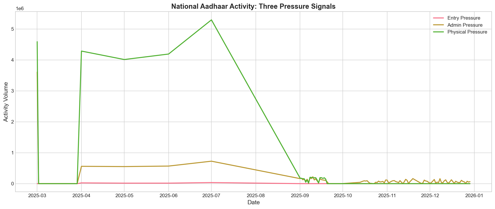
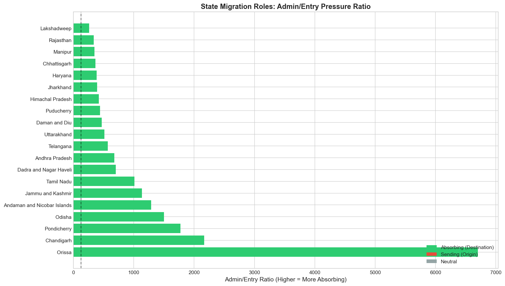
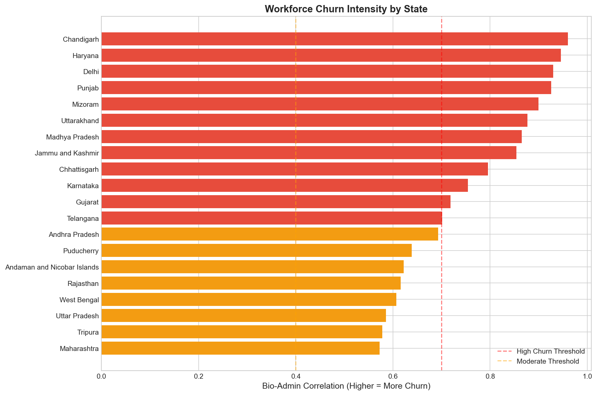
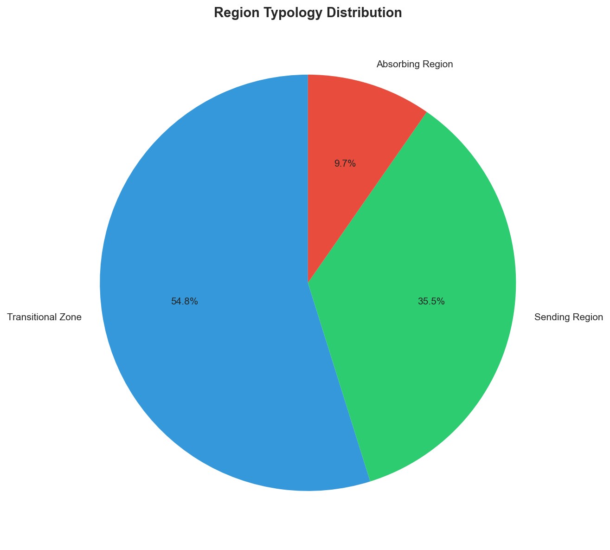
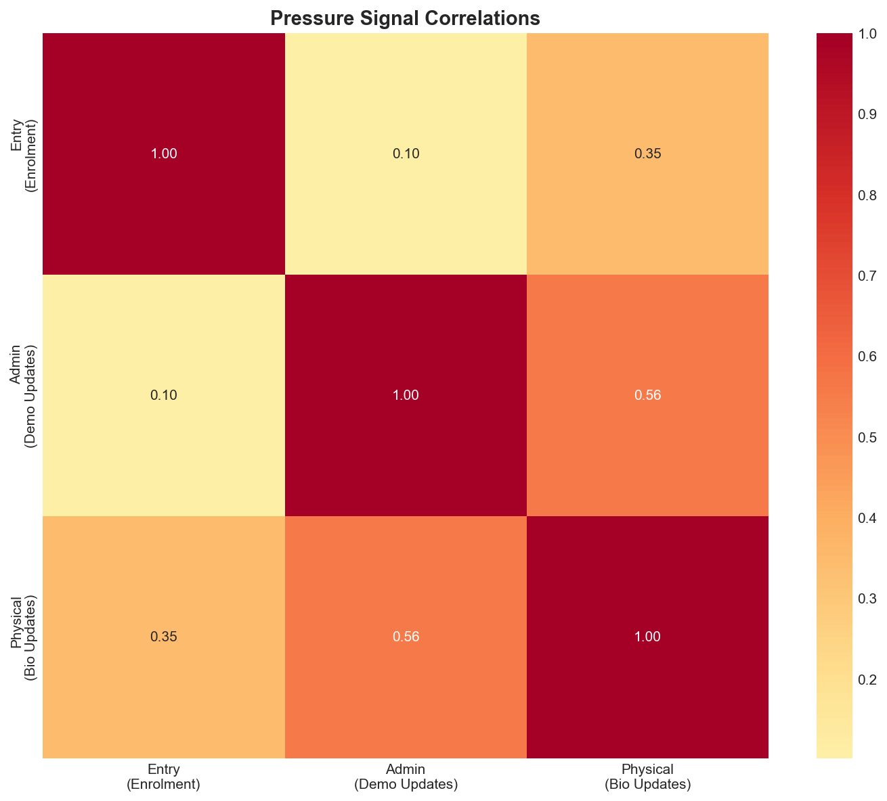

# Aadhaar Societal Insights Report

## Executive Summary

This analysis treats Aadhaar activity as three population-level pressure signals:
- **Entry Pressure**: New adults entering the identity system
- **Admin Pressure**: Life changes requiring address/identity updates
- **Physical Pressure**: Biometric re-verification needs

By examining imbalances between these signals across geography and time, we reveal migration corridors, household formation patterns, workforce churn, and urban absorption capacity—entirely at population level.

---

## Insight 1: Clear Migration Asymmetry Detected

**What we see:** States like Orissa, Chandigarh, Pondicherry show 2-3x higher admin/entry ratios than Jammu & Kashmir, Daman & Diu, Goa

**Why it matters:** High admin/entry ratio indicates people moving IN and updating addresses, while low ratio suggests origin states where people get Aadhaar but leave. This reveals internal migration pressure without tracking individuals.

---

## Insight 2: Workforce Churn Hotspots Identified

**What we see:** 12 states show bio-admin correlation >0.7: Chandigarh, Haryana, Delhi, Punjab, Mizoram

**Why it matters:** When biometric and demographic updates spike together, it signals workforce turnover—people changing jobs often need both address updates and biometric re-verification. These regions have high labor market dynamism.

---

## Insight 3: Household Formation Patterns Visible

**What we see:** States with highest household formation signals: ODISHA, andhra pradesh, Orissa, odisha, West  Bengal

**Why it matters:** Demo spikes WITHOUT enrolment spikes indicate existing Aadhaar holders changing addresses—classic household formation (marriage, new families). This is a proxy for life-stage transitions at population level.

---

## Insight 4: Urban Absorption Capacity Mapped

**What we see:** 6 states classified as absorbing/urban hubs: Orissa, Pondicherry, Dadra and Nagar Haveli, Lakshadweep, Daman & Diu

**Why it matters:** These regions consistently show more address-change activity than new enrolments—they're absorbing population from elsewhere. High churn variants indicate dynamic job markets; pure absorbing indicates residential settlement.

---

## Insight 5: National Administrative Pressure Exceeds Entry

**What we see:** Nationwide, admin pressure is 105.1x the entry pressure

**Why it matters:** More people are updating addresses than getting new Aadhaar—consistent with a maturing identity system where most adults already have Aadhaar and activity reflects life changes, not first-time enrollment.

---

## Insight 6: Northeast Shows Distinct Lifecycle Pattern

**What we see:** Northeast states predominantly classified as: Transitional Zone

**Why it matters:** The Northeast's distinct pressure profile reflects different economic patterns—likely more stable populations with different migration dynamics than the Hindi heartland corridor.

---

## Insight 7: Biometric-Heavy Regions Signal Verification Pressure

**What we see:** States with unusually high biometric activity: Orissa, Pondicherry, Odisha, Andaman and Nicobar Islands, Tamil Nadu

**Why it matters:** High biometric updates relative to demographic updates may indicate: aging population needing biometric refresh, or regions with stricter verification requirements for welfare programs.

---

## Visualizations

